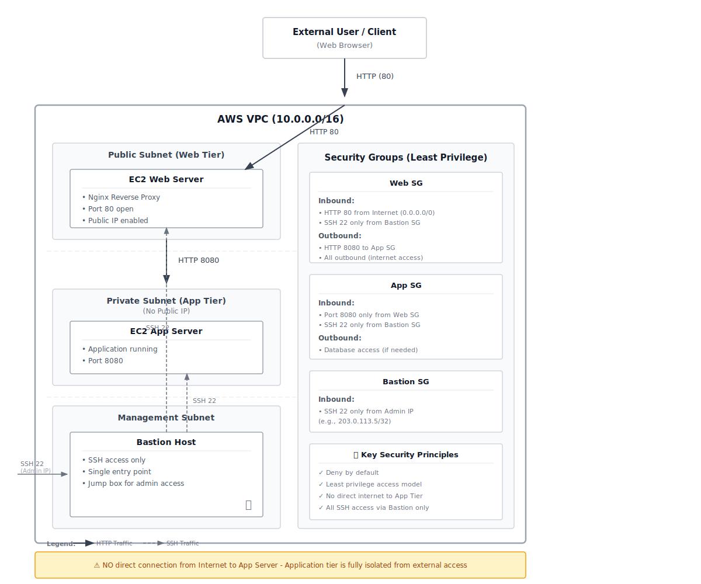

# Secure Multi-Tier Architecture

## Architecture Diagram

## Overview
This project implements a secure three-tier architecture on AWS using Terraform and Ansible.

## Tiers Explanation

### Web Tier (Public Subnet)
- Contains Nginx reverse proxy
- Exposes only HTTP (port 80) to the internet
- Forwards traffic to the application tier

### Application Tier (Private Subnet)
- Runs application on port 8080
- No public IPs
- Accessible only from Web tier and Bastion host

### Management Tier (Bastion Host)
- Single SSH entry point
- SSH access restricted to admin IPs
- Used to access private servers securely

## Security
- Security Groups follow least privilege
- SSH access only via Bastion
- Application not exposed to the internet

